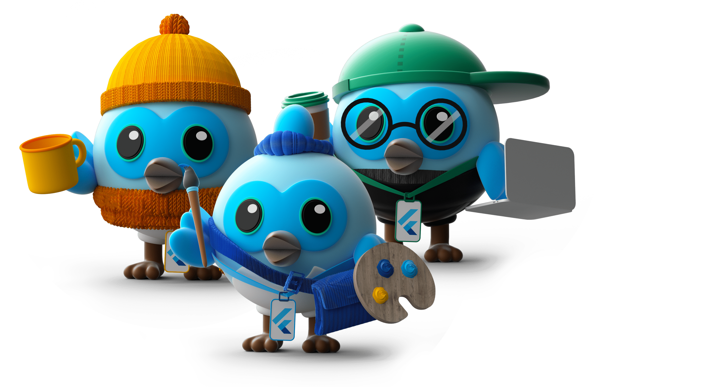

# Dashpack
📦 Flutter Extension Pack. Access a range of essential tools that simplify mobile app creation, from custom widgets to API integration, all in one place. 🚀 Speed up your development process and create exceptional Flutter apps with ease. Everything you need in one place without unnecessary extras.

- **Dart**: Dart Code extends VS Code with support for the Dart programming language, and provides tools for effectively editing, refactoring, running, and reloading Flutter mobile apps.

- **Flutter**: Adds support for effectively editing, refactoring, running, and reloading Flutter mobile apps. 

- **Bloc**: VSCode support for the Bloc Library and provides tools for effectively creating Blocs and Cubits for both Flutter and AngularDart apps.

- **Flutter Snippets**: A collection of commonly used Flutter classes and methods. It increases your speed of development by eliminating most of the boilerplate code associated with creating a widget. Widgets such as StreamBuilder and SingleChildScrollView can be created by typing the shortcut streamBldr and singleChildSV respectively.

- **Barrel file generator**: Barrel file generator for exporting your widgets, views, etc.

- **Installation of dependecies**: A Visual Studio Code extension that allows you to easily add dependencies to your Dart and Flutter project's pubspec.yaml, all without leaving your editor.

- **Translations**: VS Code extension to create a binding between your translations from .json files and your Flutter app. You can also automagically generate translations for all your locales, based on Google Translate.

**😃 Enjoy the pack!**
